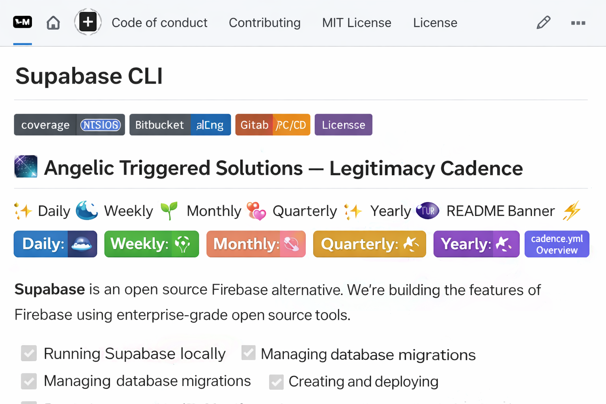

<p align="center">
  
</p>

# 🌌 Angelic Triggered Solutions — Legitimacy Cadence Workflows

This repository orchestrates **motif‑driven legitimacy flows** for stakeholders, anchored via Supabase + GitHub Actions.

---

## ✨ Cadence Rituals

| Cadence    | Schedule (UTC)         | Chart Style | Slack Motif Color |
|------------|------------------------|-------------|-------------------|
| Daily      | Every midnight         | Line chart  | Blue 🌊 (#1E90FF) |
| Weekly     | Mondays at midnight    | Bar chart   | Green 🌱 (#32CD32)|
| Monthly    | 1st of each month      | Line chart  | Pink 🌸 (#FF69B4) |
| Quarterly  | Jan/Apr/Jul/Oct 1st    | Area chart  | Gold ✨ (#FFD700) |
| Yearly     | Jan 1st                | Line chart  | Violet 🔮 (#8A2BE2)|

---

## ⚡ Workflows

- `cadence.yml` — scheduled cadence runner  
- `cadence_demo.yml` — manual demo runner (preview all cadences)  
- `weekly_legitimacy.yml` — weekly legitimacy snapshot  
- `monthly_legitimacy.yml` — monthly legitimacy snapshot  
- `quarterly_legitimacy.yml` — quarterly legitimacy snapshot  
- `yearly_legitimacy.yml` — yearly legitimacy snapshot  
- `auto_legitimacy.yml` — automated legitimacy flow

---

## 🌌 Slack Notifications

Each cadence posts a **ceremonial legitimacy report** into `#all-legitimacy-reports` with:
- Header ✨ cadence name ✨  
- Motif color strip  
- Chart link button  
- Ritualized context tagline

---

## ✅ Status Badges

  
  
  
  
  


---

## 📖 Documentation

- Charts and legitimacy flows are generated via **Supabase Storage + Plotly**.  
- Notifications are delivered through **Slack webhooks** with motif‑driven colors.  
- Each workflow is reproducible and auditable via GitHub Actions.

---

## 🛠️ Development Notes

- Ensure `.env` contains Supabase URL, Service Role Key, and Slack webhook.  
- Run `cadence_demo.py` locally to preview all five cadences.  
- Scheduled workflows run automatically; demo runner can be triggered manually.

---

## 🔮 Breaking Changes

We follow semantic versioning for cadence scripts and workflows.  
However, due to dependencies on Supabase schema migrations and Slack formatting, we cannot guarantee that all motif integrations will remain identical across major versions.

---

## 🧑‍💻 Developing

To run from source:

```sh
# Python >= 3.11
python cadence_demo.py
